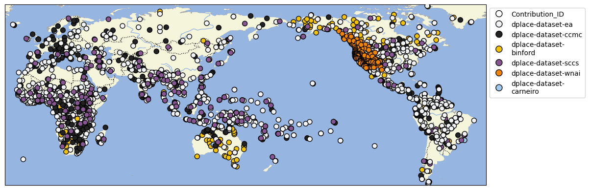

# D-PLACE aggregated dataset

## How to cite

If you use these data please cite
- the original source
  > Kathryn R. Kirby, Russell D. Gray, Simon J. Greenhill, Fiona M. Jordan, Stephanie Gomes-Ng, Hans-Jörg Bibiko, Damián E. Blasi, Carlos A. Botero, Claire Bowern, Carol R. Ember, Dan Leehr, Bobbi S. Low, Joe McCarter, William Divale, and Michael C. Gavin. (2016). D-PLACE: A Global Database of Cultural, Linguistic and Environmental Diversity. PLoS ONE, 11(7): e0158391. doi:10.1371/journal.pone.0158391.
- the derived dataset using the DOI of the [particular released version](../../releases/) you were using

## Description

This dataset is licensed under a CC-BY-NC-4.0 license

Available online at https://d-place.org

The D-PLACE CLDF dataset aggregates data from
- individual [D-PLACE datasets](https://zenodo.org/communities/phlorest),
- [Phlorest phylogenies](https://zenodo.org/communities/phlorest) and
- [Glottolog](https://glottolog.org) classification trees.

It supersedes the dataset formerly curated at
[D-PLACE/dplace-data](https://github.com/D-PLACE/dplace-data). Thus, for earlier releases of
aggregated D-PLACE data, refer to https://zenodo.org/doi/10.5281/zenodo.596376

### Data model

The tables and columns in the D-PLACE CLDF dataset are described at [cldf/README.md](cldf).
The relations between the tables are depicted in the entity-relationship diagram below. Note that
this diagram uses CLDF terms - i.e. the terms used as `dc:conformsTo` and `propertyUrl`s properties
in the [CLDF metadata](cldf/StructureDataset-metadata.json) - to refer to tables and columns.

### D-PLACE Datasets

| title | version | DOI |
|:---------------------------------------------------------------------------------------------------------------------------------|:----------|:-------------------------------------------------------------------|
| D-PLACE dataset derived from Binford 2001 'Constructing Frames of Reference' | v3.0.1 | [10.5281/zenodo.10201125](https://doi.org/10.5281/zenodo.10201125) |
| D-PLACE dataset derived from Bertolo et al. 2023 'Cross-cultural music corpus: The Expanded Natural History of Song Discography' | v3.0 | [10.5281/zenodo.10201382](https://doi.org/10.5281/zenodo.10201382) |
| D-PLACE dataset derived from Murdock et al. 1999 'Ethnographic Atlas' | v3.0 | [10.5281/zenodo.10177061](https://doi.org/10.5281/zenodo.10177061) |
| D-PLACE dataset derived from Lima-Ribeiro et al. 2015 'ecoClimate' | v3.0 | [10.5281/zenodo.10179301](https://doi.org/10.5281/zenodo.10179301) |
| D-PLACE dataset derived from 'Global Multi-resolution Terrain Elevation Data 2010' | v3.0 | [10.5281/zenodo.10180043](https://doi.org/10.5281/zenodo.10180043) |
| D-PLACE dataset derived from Wessel and Smith 2015 'Global Self-consistent, Hierarchical, High-resolution Geography Database' | v3.0.1 | [10.5281/zenodo.10182319](https://doi.org/10.5281/zenodo.10182319) |
| D-PLACE dataset derived from Jenkins et al. 2013 'Global patterns of terrestrial vertebrate diversity and conservation' | v3.0 | [10.5281/zenodo.10182356](https://doi.org/10.5281/zenodo.10182356) |
| D-PLACE dataset derived from Kreft and Jetz 2007 'Global patterns and determinants of vascular plant diversity' | v3.0 | [10.5281/zenodo.10182361](https://doi.org/10.5281/zenodo.10182361) |
| D-PLACE dataset derived from NASA TERRA/MODIS 'Net Primary Productivity' | v3.0 | [10.5281/zenodo.10183957](https://doi.org/10.5281/zenodo.10183957) |
| D-PLACE dataset derived from Murdock and White 1969 'Standard Cross-Cultural Sample' | v3.0 | [10.5281/zenodo.10201075](https://doi.org/10.5281/zenodo.10201075) |
| D-PLACE dataset derived from Olson et al. 2001 'Terrestrial Ecoregions of the World' | v3.0 | [10.5281/zenodo.10201087](https://doi.org/10.5281/zenodo.10201087) |
| D-PLACE dataset derived from Jorgensen 1980 'Western Indians' | v3.0 | [10.5281/zenodo.10201104](https://doi.org/10.5281/zenodo.10201104) |

### Phlorest Phylogenies

| title | version | DOI |
|:----------------------------------------------------------------------------------------------------------------------------------------------------------------------------|:----------|:-------------------------------------------------------------------|
| Phlorest phylogeny derived from Atkinson 2006 'From Species to Languages: a phylogenetic approach to human prehistory' | v1.2 | [10.5281/zenodo.10149488](https://doi.org/10.5281/zenodo.10149488) |
| Phlorest phylogeny derived from Birchall et al. 2016 'A combined comparative and phylogenetic analysis of the Chapacuran language family' | v1.1 | [10.5281/zenodo.10149510](https://doi.org/10.5281/zenodo.10149510) |
| Phlorest phylogeny derived from Bouckaert et al. 2012 'Mapping the Origins and Expansion of the Indo-European Language Family' | v1.1 | [10.5281/zenodo.10149518](https://doi.org/10.5281/zenodo.10149518) |
| Phlorest phylogeny derived from Bouckaert et al. 2018 'The origin and expansion of Pama–Nyungan languages across Australia' | v1.1 | [10.5281/zenodo.10149537](https://doi.org/10.5281/zenodo.10149537) |
| Phlorest phylogeny derived from Bowern & Atkinson 2012 'Computational phylogenetics and the internal structure of Pama-Nyungan' | v1.1 | [10.5281/zenodo.10149544](https://doi.org/10.5281/zenodo.10149544) |
| Phlorest phylogeny derived from Chacon & List 2015 'Improved computational models of sound change shed light on the history of the Tukanoan languages' | v1.1 | [10.5281/zenodo.10149552](https://doi.org/10.5281/zenodo.10149552) |
| Phlorest phylogeny derived from Chang et al. 2015 'Ancestry-constrained phylogenetic analysis supports the Indo-European steppe hypothesis' | v1.1 | [10.5281/zenodo.10149561](https://doi.org/10.5281/zenodo.10149561) |
| Phlorest phylogeny derived from De Filippo et al. 2012 'Bringing together linguistic and genetic evidence to test the Bantu expansion' | v1.1 | [10.5281/zenodo.10149579](https://doi.org/10.5281/zenodo.10149579) |
| Phlorest phylogeny derived from Dunn et al. 2011 'Evolved structure of language shows lineage-specific trends in word-order universals' | v1.1 | [10.5281/zenodo.10149621](https://doi.org/10.5281/zenodo.10149621) |
| Phlorest phylogeny derived from Gray et al. 2009 'Language phylogenies reveal expansion pulses and pauses in Pacific settlement' | v1.1.1 | [10.5281/zenodo.10149668](https://doi.org/10.5281/zenodo.10149668) |
| Phlorest phylogeny derived from Greenhill 2015 'TransNewGuinea.org: An Online Database of New Guinea Languages' | v1.1 | [10.5281/zenodo.10149678](https://doi.org/10.5281/zenodo.10149678) |
| Phlorest phylogeny derived from Grollemund et al. 2015 'Bantu expansion shows habitat alters the route and pace of human dispersals' | v1.1 | [10.5281/zenodo.10149683](https://doi.org/10.5281/zenodo.10149683) |
| Phlorest phylogeny derived from Honkola et al. 2013 'Cultural and climatic changes shape the evolutionary history of the Uralic languages' | v1.1 | [10.5281/zenodo.10149686](https://doi.org/10.5281/zenodo.10149686) |
| Phlorest phylogeny derived from Hruschka et al. 2015 'Detecting regular sound changes in linguistics as events of concerted evolution' | v1.1 | [10.5281/zenodo.10149695](https://doi.org/10.5281/zenodo.10149695) |
| Phlorest phylogeny derived from Kitchen et al. 2009 'Bayesian phylogenetic analysis of Semitic languages identifies an Early Bronze Age origin of Semitic in the Near East' | v1.1 | [10.5281/zenodo.10149760](https://doi.org/10.5281/zenodo.10149760) |
| Phlorest phylogeny derived from Kolipakam et al. 2018 'A Bayesian phylogenetic study of the Dravidian language family' | v1.1 | [10.5281/zenodo.10149769](https://doi.org/10.5281/zenodo.10149769) |
| Phlorest phylogeny derived from Lee 2015 'A Sketch of Language History in the Korean Peninsula' | v1.1 | [10.5281/zenodo.10149812](https://doi.org/10.5281/zenodo.10149812) |
| Phlorest phylogeny derived from Lee & Hasegawa 2011 'Bayesian phylogenetic analysis supports an agricultural origin of Japonic languages' | v1.1 | [10.5281/zenodo.10149409](https://doi.org/10.5281/zenodo.10149409) |
| Phlorest phylogeny derived from Lee & Hasegawa 2013 'Evolution of the Ainu Language in Space and Time' | v1.1 | [10.5281/zenodo.10149825](https://doi.org/10.5281/zenodo.10149825) |
| Phlorest phylogeny derived from Robinson and Holton 2012 'Internal Classification of the Alor-Pantar Language Family Using Computational Methods Applied to the Lexicon' | v1.1 | [10.5281/zenodo.10149839](https://doi.org/10.5281/zenodo.10149839) |
| Phlorest phylogeny derived from Sagart et al. 2019 'Dated language phylogenies shed light on the ancestry of Sino-Tibetan' | v1.1 | [10.5281/zenodo.10149865](https://doi.org/10.5281/zenodo.10149865) |
| Phlorest phylogeny derived from Sicoli & Holton 2014 'Linguistic phylogenies support back-migration from Beringia to Asia' | v1.1 | [10.5281/zenodo.10149871](https://doi.org/10.5281/zenodo.10149871) |
| Phlorest phylogeny derived from Walker & Ribeiro 2011 'Bayesian phylogeography of the Arawak expansion in lowland South America' | v1.1 | [10.5281/zenodo.10149891](https://doi.org/10.5281/zenodo.10149891) |
| Phlorest phylogeny derived from Zhang et al 2019 'Phylogenetic evidence for Sino-Tibetan origin in northern China in the Late Neolithic' | v1.1 | [10.5281/zenodo.10149910](https://doi.org/10.5281/zenodo.10149910) |

## CLDF Datasets

The following CLDF datasets are available in [cldf](cldf):

- CLDF [StructureDataset](https://github.com/cldf/cldf/tree/master/modules/StructureDataset) at [cldf/StructureDataset-metadata.json](cldf/StructureDataset-metadata.json)